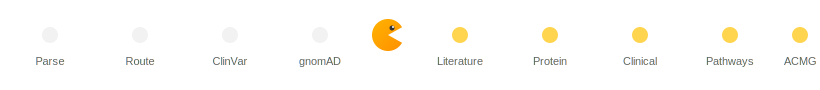

# PathoMAN 2.0
**Pathogenicity of Mutation Analyzer — for Clinical Cancer Genomics**

An AI-powered genomic variant annotation and classification tool built with LangGraph multi-agent architecture, Streamlit, and Claude (claude-sonnet-4-5). It integrates evidence from **12+ data sources** — ClinVar, gnomAD (v4 + v3 + v2), dbNSFP, UniProt, LitVar, PubTator3, Europe PMC, CIViC, ClinGen, GWAS Catalog, Reactome, and DGIdb — via direct APIs and **BioMCP** to produce ACMG/AMP 2015-compliant variant classifications with full transparency into every decision.

> **DISCLAIMER:** This is a research prototype. It has **not** been validated for clinical use. Variant classifications should be reviewed by a certified clinical molecular geneticist and confirmed through validated, CLIA-certified processes.

> **VERSION 2.1 — April 30, 2026.** Adds a hybrid RAG layer over the ClinGen SVI/VCEP corpus (Richards 2015 + 5 SVI/VCEP papers, FAISS-indexed), all six active SVI overrides applied by default (Abou Tayoun 2018 PVS1 11-branch tree, Riggs 2020 ClinGen Haploinsufficiency Score gate, Ghosh 2018 PM2_Supporting downgrade, Pejaver 2022 PP3/BP4 REVEL calibration, Tavtigian 2018 Bayesian combining, SVI 2018 PP5/BP6 deprecation), dual-framework verdicts (Tavtigian primary + Richards Table 5 in parallel) with disagreement detection, three-layer Microsoft Responsible AI guardrails, plain-English LLM explainer (patient + curator audiences), and a build-validator that flags GRCh37/GRCh38 notation/build mismatches. See `INTEGRATION_NOTES.md` for the per-file changelog.

---

## 🚀 Brand-new to this? Start here

If you've never used Python, an API, or a `.env` file before — read **[`SETUP_FOR_BEGINNERS.md`](./SETUP_FOR_BEGINNERS.md)**. It walks through everything from "what is an API key" through to your first variant classification. ~30 minutes start to finish, no prior knowledge needed.

---

## 📚 How to cite this work

PathoMAN 2.0 is published under the Apache 2.0 license **with an attribution-and-citation amendment** (see `LICENSE` and `NOTICE`). Any academic, research, software-derivative, or clinical-presentation use **must cite** this repository.

**Minimum APA citation:**
> Ravichandran, V. (2026). *PathoMAN 2.0: Pathogenicity of Mutation Analyzer — A hybrid retrieval-augmented agentic pipeline for ACMG/AMP germline variant classification* (Version 2.1) [Computer software]. Department of Health Informatics, Rutgers School of Health Professions. https://github.com/vigneshravi/PathoMAN2.0

For BibTeX / RIS / IEEE / MLA / Chicago / Harvard formats, click the **"Cite this repository"** button on the GitHub page (powered by `CITATION.cff`).

If you use the **specific algorithms or thresholds** PathoMAN implements (Abou Tayoun PVS1 tree, Pejaver REVEL calibration, Tavtigian Bayesian combining, etc.), you must also cite the primary papers — see `NOTICE` for the full list.

**Forks, derivative repositories, and commercial use** must additionally:
- Keep the unmodified `NOTICE` file at the project root
- Link back to https://github.com/vigneshravi/PathoMAN2.0 in their README
- For commercial use, request prior written permission

---

## Table of Contents

- [Architecture Overview](#architecture-overview)
- [Data Sources & Evidence Flow](#data-sources--evidence-flow)
- [gnomAD Cohort Configuration](#gnomad-cohort-configuration)
- [ACMG Criteria Implementation](#acmg-criteria-implementation)
- [UI Design](#ui-design)
- [Step-by-Step Classification Walkthrough](#step-by-step-classification-walkthrough)
- [Assumptions & Design Decisions](#assumptions--design-decisions)
- [Project Structure](#project-structure)
- [Installation & Setup](#installation--setup)
- [Usage](#usage)
- [Limitations](#limitations)

---

## Architecture Overview

The application uses a **LangGraph StateGraph** with **9 sequential nodes**. Each node is an independent agent that reads from and writes to a shared `VariantState` dictionary. During processing, a pac-man animation eats through the pipeline stages:



### System Architecture Flowchart

```
┌─────────────────────────────────────────────────────────────────────┐
│                    STREAMLIT UI (app.py)                             │
│  PathoMAN 2.0 — AI-Powered ACMG Variant Classification             │
│                                                                     │
│  ┌─────────────────┐  ┌──────────────────┐  ┌───────────────────┐  │
│  │ Gene + HGVS     │  │ Genomic          │  │ Look Up / Classify│  │
│  │ Input           │  │ Coordinates      │  │ (auto-resolve)    │  │
│  └────────┬────────┘  └────────┬─────────┘  └────────┬──────────┘  │
│           └────────────────────┴─────────────────────┘             │
│                                │                                    │
│                   [Pac-Man Pipeline Animation]                      │
│                                │                                    │
│  ┌─── CLASSIFICATION HERO BANNER ──────────────────────────────┐   │
│  │  ████ PATHOGENIC ████  Confidence: High  │  Reasoning       │   │
│  └──────────────────────────────────────────────────────────────┘   │
│  [ACMG Criteria Pills: PVS1 PS1 PS3 PM2 BA1 BS1 BP4 ...]         │
│                                                                     │
│  TABS: [Frequencies] [ClinVar] [Literature] [Structure]            │
│        [Public Datasets] [Pathways] [Case-Control]                  │
└─────────────────────────────────────────────────────────────────────┘
                                 │
                    ┌────────────▼────────────┐
                    │     LangGraph Pipeline   │
                    └────────────┬────────────┘
                                 │
┌────────────────────────────────▼────────────────────────────────────┐
│                         GRAPH NODES (9)                              │
│                                                                     │
│  ┌──────────────┐    ┌────────────┐    ┌──────────────────────┐    │
│  │ 1. INPUT     │───▶│ 2. SUPER-  │───▶│ 3. CLINVAR AGENT     │    │
│  │    PARSER    │    │    VISOR   │    │    Entrez esearch/    │    │
│  │              │    │ (router)   │    │    esummary + XML     │    │
│  │ • Parse HGVS │    │            │    │    parse + HGVS       │    │
│  │ • VEP annot. │    │ • Check    │    │    validation         │    │
│  │ • NM↔ENST    │    │   fields   │    │                      │    │
│  │ • Transcript │    │ • Route or │    │ Outputs:             │    │
│  │   ranking    │    │   END      │    │ • variant_id, HGVS   │    │
│  │ • Left-align │    │            │    │ • significance       │    │
│  │   coords     │    │            │    │ • star_rating, rsID  │    │
│  └──────────────┘    └────────────┘    └──────────┬───────────┘    │
│                                                    │                │
│  ┌──────────────────────────────────────────────────▼──────────┐   │
│  │ 4. GNOMAD + IN SILICO AGENT                                 │   │
│  │                                                              │   │
│  │ ┌─────────────┐ ┌─────────────┐ ┌────────────┐ ┌─────────┐ │   │
│  │ │ gnomAD      │ │ MyVariant   │ │ gnomAD     │ │ UniProt │ │   │
│  │ │ GraphQL     │ │ .info       │ │ Gene       │ │ REST    │ │   │
│  │ │             │ │             │ │ Constraint │ │         │ │   │
│  │ │ • 4 cohorts │ │ • dbNSFP    │ │            │ │ Domains │ │   │
│  │ │   v4 807K   │ │   REVEL     │ │ • mis_z    │ │ Repeats │ │   │
│  │ │   v3 76K    │ │   CADD      │ │ • LOEUF    │ │ Motifs  │ │   │
│  │ │   non-cancer│ │   MetaRNN   │ │ • pLI      │ │         │ │   │
│  │ │   controls  │ │   BayesDel  │ │            │ │         │ │   │
│  │ │ • Per-pop   │ │   AlphaM.   │ │            │ │         │ │   │
│  │ │   AFs       │ │   SIFT      │ │            │ │         │ │   │
│  │ │ • rsID      │ │   PolyPhen  │ │            │ │         │ │   │
│  │ │   lookup    │ │ • Conserv.  │ │            │ │         │ │   │
│  │ └─────────────┘ └─────────────┘ └────────────┘ └─────────┘ │   │
│  │                                                              │   │
│  │ Pre-computes: BA1, BS1, PM2, PP3, BP4, PM1, PM4, BP3        │   │
│  └──────────────────────────────────────────┬───────────────────┘   │
│                                              │                      │
│  ┌───────────────────────────────────────────▼──────────────────┐   │
│  │ 5. LITERATURE AGENT                                          │   │
│  │                                                               │   │
│  │ • LitVar entity search by rsID                                │   │
│  │ • PubTator3 NLP-annotated articles (direct NCBI API)          │   │
│  │ • Europe PMC via BioMCP (federated search)                    │   │
│  │ • PubMed MEDLINE enrichment (title, journal, pub type)        │   │
│  │ • Classify: case reports / functional studies / reviews        │   │
│  │                                                               │   │
│  │ Supports: PS3 (functional studies), PS4 (case reports)        │   │
│  └───────────────────────────────────┬───────────────────────────┘   │
│                                       │                              │
│  ┌────────────────────────────────────▼──────────────────────────┐   │
│  │ 6. PROTEIN STRUCTURE AGENT (BioMCP)                           │   │
│  │                                                               │   │
│  │ • UniProt protein info (function, domains, InterPro)          │   │
│  │ • PDB structures (experimental 3D)                            │   │
│  │ • AlphaFold predicted structure links                         │   │
│  └────────────────────────────────────┬──────────────────────────┘   │
│                                       │                              │
│  ┌────────────────────────────────────▼──────────────────────────┐   │
│  │ 7. CLINICAL EVIDENCE AGENT (BioMCP)                           │   │
│  │                                                               │   │
│  │ • CIViC: clinical evidence items + assertions                 │   │
│  │ • ClinGen: gene-disease validity + dosage sensitivity         │   │
│  │ • GWAS Catalog: SNP-trait associations                        │   │
│  └────────────────────────────────────┬──────────────────────────┘   │
│                                       │                              │
│  ┌────────────────────────────────────▼──────────────────────────┐   │
│  │ 8. PATHWAY & DRUGGABILITY AGENT (BioMCP)                      │   │
│  │                                                               │   │
│  │ • Reactome pathways                                           │   │
│  │ • DGIdb druggability categories + drug interactions            │   │
│  └────────────────────────────────────┬──────────────────────────┘   │
│                                       │                              │
│  ┌────────────────────────────────────▼──────────────────────────┐   │
│  │ 9. ACMG CLASSIFIER (Claude claude-sonnet-4-5)                │   │
│  │                                                               │   │
│  │ • Receives ALL evidence from prior nodes                      │   │
│  │ • Structured prompt with pre-computed criteria flags           │   │
│  │ • PVS1 assessment with last-exon / penultimate caveats        │   │
│  │ • Applies ACMG combining rules                                │   │
│  │ • Returns: criteria_triggered, classification, reasoning       │   │
│  └───────────────────────────────────────────────────────────────┘   │
└─────────────────────────────────────────────────────────────────────┘
```

### Graph Edge Flow

```
START → input_parser → supervisor ─┬─→ clinvar_agent → gnomad_agent
                                    │    → pubmed_agent → alphafold_agent
                                    │    → tcga_agent → pathway_agent
                                    │    → acmg_classifier → END
                                    │
                                    └─→ END  (on parse error)
```

---

## Data Sources & Evidence Flow

| Source | API | Data Retrieved | ACMG Criteria | Fallback if Unavailable |
|--------|-----|---------------|---------------|------------------------|
| **Ensembl VEP** | REST `/vep/homo_sapiens/hgvs/` | Transcript consequences, exon position, amino acid change, impact, protein position | PVS1 (exon assessment) | Tries up to 5 NM_ transcripts from ClinVar counts + Ensembl canonical. If all VEP calls fail, proceeds without transcript annotation — PVS1 cannot be assessed. |
| **Ensembl Xrefs** | REST `/xrefs/id/`, `/xrefs/symbol/` | NM_ ↔ ENST transcript mapping | Transcript resolution | If xrefs API fails, NM_ field left empty. ClinVar pathogenic counts used as primary NM_ source. |
| **NCBI ClinVar** | Entrez esearch + esummary | Clinical significance, star rating, submitters, rsID, condition | PS1, PP5, BP6 | Tries 4-8 ranked queries with HGVS validation. If all fail: PS1/PP5/BP6 "not evaluable." |
| **NCBI Gene** | Entrez esearch + esummary | Gene aliases, full name, pathogenic submission counts per NM_ | Transcript ranking | If Gene API fails: ranking falls back to MANE/Canonical only. |
| **gnomAD v4.1.0 + v3.1.2 / v2.1.1** | GraphQL API | Allele frequencies (4 cohorts GRCh38 / 3 cohorts GRCh37), per-population breakdown, homozygotes | BA1, BS1, PM2 | Tries: coordinate-based query → rsID query → variant_search. Absent variant = PM2 met. Cohort fallback: controls → non-cancer → overall → v4. |
| **MyVariant.info** | REST API | dbNSFP scores (REVEL, CADD, MetaRNN, BayesDel, AlphaMissense, SIFT, PolyPhen2), conservation (phyloP, phastCons, GERP++) | PP3, BP4 | If no data (common for indels): PP3/BP4 "not evaluable." |
| **gnomAD Gene Constraint** | GraphQL API | Missense Z-score, o/e ratio, pLI, LOEUF | PM1 | If fails: PM1 assessed from domain overlap alone (Supporting). |
| **UniProt** | REST API | Functional domains, repeat regions, protein length | PM1, PM4, BP3 | If fails: PM1 limited to constraint-only. PM4/BP3 "not evaluable." |
| **NCBI LitVar** | REST API | Publication count, disease associations, PubMed metadata | PS3, PS4 | If no rsID: LitVar skipped, PS3/PS4 "not evaluable." |
| **PubTator3** | REST API (direct) | NLP-annotated articles, variant/disease/gene entities, relevance scores | PS3, PS4 | If fails: LitVar results still used. |
| **Europe PMC** | BioMCP CLI | Federated literature search, citation counts | PS3, PS4 | If fails: LitVar/PubTator3 results still used. |
| **CIViC** | BioMCP CLI + GraphQL | Clinical evidence items, assertions, therapies | Clinical context | If fails: classification proceeds without CIViC. |
| **ClinGen** | BioMCP CLI | Gene-disease validity, haploinsufficiency, triplosensitivity | Clinical context | If fails: classification proceeds without ClinGen. |
| **GWAS Catalog** | BioMCP CLI | SNP-trait associations, p-values, effect sizes | Clinical context | If fails: classification proceeds without GWAS. |
| **Reactome** | BioMCP CLI | Biological pathways for gene | Pathway context | If fails: pathways section empty. |
| **DGIdb** | BioMCP CLI | Druggability categories, drug interactions | Druggability context | If fails: druggability section empty. |
| **UniProt (BioMCP)** | BioMCP CLI | Protein function, InterPro domains, PDB structures | Structural context | If fails: structure tab empty. |
| **Claude claude-sonnet-4-5** | LangChain / Anthropic API | ACMG criteria synthesis, combining rules, clinical reasoning | Final classification | If fails: retried once. If retry fails: defaults to VUS. |

---

## gnomAD Cohort Configuration

### GRCh38 (4 cohorts, ordered)

| # | Dataset | Key | Label | Samples |
|---|---------|-----|-------|---------|
| 1 | `gnomad_r4` | `v4_overall` | gnomAD v4.1.0 | 807,162 |
| 2 | `gnomad_r3` | `v3_overall` | gnomAD v3.1.2 genomes | 76,156 |
| 3 | `gnomad_r3_non_cancer` | `v3_non_cancer` | gnomAD v3.1.2 non-cancer | 74,023 |
| 4 | `gnomad_r3_controls_and_biobanks` | `v3_controls` | gnomAD v3.1.2 controls | 16,465 |

### GRCh37 (3 cohorts, ordered)

| # | Dataset | Key | Label | Samples |
|---|---------|-----|-------|---------|
| 1 | `gnomad_r2_1` | `overall` | gnomAD v2.1.1 | 141,456 |
| 2 | `gnomad_r2_1_non_cancer` | `non_cancer` | gnomAD v2.1.1 non-cancer | 134,187 |
| 3 | `gnomad_r2_1_controls` | `controls` | gnomAD v2.1.1 controls | 60,146 |

### Frequency Criteria Priority (controls-first)

For BA1/BS1/PM2 evaluation AND Fisher's test reference population:

- **GRCh38:** `v3_controls` → `v3_non_cancer` → `v3_overall` → `v4_overall`
- **GRCh37:** `controls` → `non_cancer` → `overall`

The UI explicitly labels which cohort was selected: *"Using **gnomAD v3.1.2 controls** as reference population"*

### Absent variant handling

Every cohort always gets a row in the display table. If the variant is not found in a cohort: `{available: False, global_af: None}` is shown as "Not Available" rather than being silently omitted.

---

## ACMG Criteria Implementation

### Criteria Evaluated (14 of 28)

#### Pathogenic Criteria

**PVS1 — Null variant (Very Strong / Strong / Moderate)**
- **Source:** VEP consequence + exon position
- **Logic:** Null variant (frameshift, stop_gained, splice_donor/acceptor, start_lost) in gene where LOF is a known disease mechanism
- **Caveats (ClinGen PVS1 decision tree):**
  - Last exon → downgrade to Moderate (may escape NMD, produce stable truncated protein)
  - Penultimate exon (last 50bp) → downgrade to Strong
  - Single-exon gene → downgrade to Moderate (NMD not applicable)
  - Not a null variant (missense, in-frame, synonymous) → PVS1 does NOT apply
- **Assumptions:** Uses VEP `exon` field (e.g., "19/23"). Assumes Ensembl canonical is the clinically relevant transcript.
- **Fallback:** If VEP fails to annotate the variant (no transcript consequences returned), PVS1 cannot be assessed. Exon position unknown → PVS1 marked "not evaluable — no VEP annotation." Classifier informed via prompt; classification relies on remaining criteria.

**PS1 — Same amino acid change as established pathogenic (Strong)**
- **Source:** ClinVar
- **Logic:** Same amino acid change already classified as pathogenic in ClinVar with ≥2-star review
- **Assumptions:** Evaluated by Claude from ClinVar data. Requires ClinVar record to exist.
- **Fallback:** If ClinVar record not found → PS1 not evaluable. If ClinVar found but no pathogenic classification → PS1 not met.

**PS3 — Well-established functional studies (Strong)**
- **Source:** LitVar → PubMed MEDLINE enrichment
- **Logic:** Publication type classification from PubMed's `PT` field — looks for "Research Support", "Comparative Study", "Evaluation Study"
- **Assumptions:** Heuristic classification. LitVar may not capture all functional studies. Only top 15 PMIDs enriched.
- **Fallback:** If no rsID available (ClinVar didn't return one) → LitVar skipped, PS3 "not evaluable — no rsID for literature search." If LitVar returns no data → PS3 "not evaluable — no literature found." If PubMed enrichment fails → publication count available but type classification unavailable, PS3 assessment limited to count only.

**PS4 — Prevalence significantly increased in affected (Strong)**
- **Source:** LitVar disease associations + case report count
- **Logic:** Multiple case reports and disease association publications across populations
- **Assumptions:** Relies on LitVar's automated literature mining. Does not perform independent statistical analysis.
- **Fallback:** Same as PS3 — depends on LitVar/rsID availability. If no literature → PS4 "not evaluable." Case-control Fisher's test in the UI provides independent statistical PS4 support if user provides cohort data.

**PM1 — Functional domain / missense hotspot (Moderate / Supporting)**
- **Source:** gnomAD gene constraint + UniProt domains
- **Logic:** Missense variant in UniProt functional domain (Domain, Zinc finger, DNA binding, Motif) AND gene is missense-constrained (Z > 2.0). Domain + constraint → Moderate; domain only → Supporting.
- **Assumptions:** Only applies to missense variants. UniProt "Region" annotations excluded (too noisy). Protein position from VEP must be available.
- **Fallback:** If gnomAD constraint API fails → PM1 can still be assessed from domain overlap alone (Supporting). If UniProt API fails → no domain data, PM1 "not evaluable — no domain annotations." If VEP didn't return `protein_start` → domain overlap check impossible, PM1 not evaluable. If variant is not missense → PM1 explicitly "does not apply."

**PM2 — Absent from controls (Supporting)**
- **Source:** gnomAD controls global AF
- **Logic:** Global AF < 0.01% (0.0001) in controls cohort
- **Assumptions:** Downgraded to Supporting per ClinGen SVI 2020. Uses global AF only, not per-population max.
- **Fallback:** If variant not found in any gnomAD cohort → PM2 = MET (absent = rare, supports pathogenicity). If gnomAD API entirely fails → PM2 "not evaluable — gnomAD query failed." Cohort selection fallback: controls → non-cancer → overall.

**PM4 — Protein length change (Moderate)**
- **Source:** VEP consequence + UniProt repeats
- **Logic:** In-frame deletion/insertion in a non-repeat region
- **Assumptions:** Checks `inframe_deletion` / `inframe_insertion` in VEP consequence_terms. Repeat check uses UniProt "Repeat" features only.
- **Fallback:** If VEP consequence not available → PM4 "not evaluable." If UniProt fails → cannot check repeat status, assumes non-repeat (PM4 may apply). If variant is not in-frame → PM4 explicitly "does not apply."

**PP3 — Computational evidence supports damaging (Supporting)**
- **Source:** dbNSFP (via MyVariant.info) + CADD
- **Logic:** ≥3 tools predict damaging with majority consensus. Thresholds: REVEL > 0.75, CADD phred > 25, AlphaMissense > 0.564, BayesDel > 0.0692, MetaRNN = "D", SIFT < 0.05, PolyPhen2 > 0.85.
- **Assumptions:** ClinGen SVI-recommended thresholds. Consensus requires at least 3 agreeing tools.
- **Fallback:** If MyVariant.info returns no data (common for indels/insertions/deletions) → PP3 "not evaluable — no in silico scores for this variant type." Consensus shows "Uncertain." If hg19 liftover fails → tries rsID-based MyVariant query. If individual predictors missing → score skipped, consensus computed from available tools only (may have <3 tools → not evaluable).

**PP5 — Reputable source classifies pathogenic (Supporting / Moderate / Strong)**
- **Source:** ClinVar star rating
- **Logic:** 3+ stars (expert panel) → Strong; 2 stars → Moderate; 1 star → Supporting
- **Assumptions:** Per ClinGen recommendation for evidence strength scaling.
- **Fallback:** If ClinVar not found → PP5 not evaluable. If ClinVar found with 0 stars (no assertion criteria) → PP5 not triggered.

#### Benign Criteria

**BA1 — Allele frequency > 5% (Stand-alone)**
- **Source:** gnomAD controls global AF
- **Logic:** Global AF > 5% → Stand-alone Benign (sufficient alone for Benign classification)
- **Assumptions:** Uses controls global AF only. 5% is the standard ACMG threshold.
- **Fallback:** Same cohort fallback as PM2 (controls → non-cancer → overall). If gnomAD entirely unavailable → BA1 not evaluable.

**BS1 — Allele frequency > 1% (Strong)**
- **Source:** gnomAD controls global AF
- **Logic:** Global AF > 1%, greater than expected for rare disease
- **Assumptions:** 1% threshold assumes rare disease gene. Uses global AF, NOT per-population max (avoids founder effect false positives like Finnish CHEK2).
- **Fallback:** Same as BA1. If gnomAD unavailable → BS1 not evaluable.

**BP3 — In-frame indel in repetitive region (Supporting)**
- **Source:** VEP consequence + UniProt repeats
- **Logic:** In-frame deletion/insertion within a UniProt-annotated repeat region
- **Assumptions:** Only triggers for in-frame variants in repeat regions.
- **Fallback:** If UniProt fails → no repeat data, BP3 cannot be assessed (defaults to not met). If VEP consequence not available → BP3 not evaluable.

**BP4 — Computational evidence supports no impact (Supporting)**
- **Source:** dbNSFP + CADD
- **Logic:** ≥3 tools predict benign. Thresholds: REVEL < 0.15, CADD phred < 15.
- **Assumptions:** Mirror of PP3 logic.
- **Fallback:** Same as PP3 — if no in silico data available → BP4 "not evaluable."

**BP6 — Reputable source classifies benign (Supporting / Moderate / Strong)**
- **Source:** ClinVar star rating
- **Logic:** Same strength scaling as PP5 but for benign classifications
- **Assumptions:** ClinVar benign classifications with expert panel review are reliable.
- **Fallback:** If ClinVar not found → BP6 not evaluable.

### Frequency Criteria: Cohort Selection Logic

```
Priority for BA1 / BS1 / PM2 evaluation (defined in FREQ_PRIORITY):

GRCh38: v3_controls → v3_non_cancer → v3_overall → v4_overall
GRCh37: controls → non_cancer → overall

Fallback chain example (CHEK2 c.1100delC on GRCh37):
  → Try v2.1.1 controls: found, global AF = 0.002368 ✓ → use this
  → UI shows: "Using gnomAD v2.1.1 controls (60K) as reference"

Fallback chain example (variant not in controls):
  → Try controls: variant not found (available: false)
  → Try non-cancer: found, global AF = 0.000045 ✓ → use this
  → UI shows: "Using gnomAD v3.1.2 non-cancer (74K) as reference"

Fallback chain example (gnomAD API down):
  → All cohorts fail → frequency criteria "not evaluable"
  → Warning shown in UI

Within each cohort:
- Use GLOBAL allele frequency only
- Do NOT use per-population max AF (avoids founder effects)

Case-control analysis (Fisher's / GLM) uses the same priority.
The UI explicitly labels: "Using gnomAD v3.1.2 controls as reference
population for Fisher's test"
```

### ACMG Combining Rules

The classifier applies standard ACMG/AMP 2015 combining rules:

```
Pathogenic:
  • 1 Very Strong + ≥1 Strong
  • ≥2 Strong
  • 1 Strong + ≥3 Moderate/Supporting
  • 1 Very Strong + ≥2 Moderate

Likely Pathogenic:
  • 1 Strong + 1-2 Moderate
  • 1 Strong + ≥2 Supporting
  • ≥3 Moderate
  • 2 Moderate + ≥2 Supporting

Benign:
  • 1 Stand-alone (BA1)
  • ≥2 Strong benign

Likely Benign:
  • 1 Strong benign + 1 Supporting benign

VUS:
  • Does not meet any of the above
```

---

## Step-by-Step Classification Walkthrough

### Example: BRCA1 c.5266dupC (GRCh38)

This traces every decision point in the pipeline for the well-known BRCA1 5382insC founder mutation.

#### Step 1: Input Parsing

```
Input: "BRCA1 c.5266dupC"
├── Parse: gene=BRCA1, cdna=c.5266dupC, mode=hgvs
├── ClinVar pathogenic count lookup:
│   └── NM_007294.4: 196 submissions → primary transcript
├── VEP query: NM_007294.4:c.5266dupC
│   ├── VEP accepted ✓
│   ├── vcf_string: 17-43057063-G-GG (right-aligned)
│   └── Left-aligned: 17-43057062-T-TG (matches gnomAD)
├── Ensembl NM↔ENST mapping: 32 protein-coding transcripts
│   └── ENST00000357654 → NM_007294.4 (via xrefs/id)
├── Gene aliases: BRCAI, BRCC1, BROVCA1, FANCS, IRIS, ...
├── Transcript ranking:
│   └── NM_007294.4 / ENST00000357654  score=9
│       [MANE Select + Most Reported + Canonical + has NM_]
├── VEP annotation for selected transcript:
│   ├── Consequence: frameshift_variant
│   ├── Impact: HIGH
│   ├── Exon: 19/23
│   ├── Protein: position 1755-1756, AA: -/X
│   └── Strand: -1 (minus strand)
└── Output:
    ├── selected_transcript: NM_007294.4
    ├── hgvs_on_transcript: NM_007294.4:c.5266dupC
    └── coordinates: chr17:43057062 T>TG
```

#### Step 2: Supervisor Routing

```
Check: gene_symbol=BRCA1 ✓, hgvs_on_transcript set ✓
Decision: Route to clinvar_agent ✓
```

#### Step 3: ClinVar Agent

```
Query strategy (ranked):
├── Try 1: "NM_007294.4:c.5266dupC[HGVS]"
│   └── Result: variant_id=3336480, HGVS=c.206_207delinsTG
│       └── HGVS mismatch! Position c.5266 ≠ c.206 → REJECTED
├── Try 2: "NM_007294.4:c.5266dupC[Variant name]"
│   └── Same wrong result → REJECTED
├── Try 3: "BRCA1 c.5266dupC" (raw input fallback)
│   └── Search: BRCA1[gene] AND c.5266dupC[Variant name]
│       └── Result: variant_id=17677 ✓
│           HGVS: NM_007294.4(BRCA1):c.5266dup (p.Gln1756fs)
│           Position match: c.5266 = c.5266 ✓
│           Type match: dup = dup ✓ → ACCEPTED
├── Dup notation expansion:
│   └── Also tried: c.5266dupA, c.5266dupC, c.5266dupG, c.5266dupT
│       (ClinVar stores "c.5266dupC" but some entries use "c.5266dup")
└── Final ClinVar record:
    ├── Variant ID: 17677
    ├── Clinical Significance: Pathogenic
    ├── Review Status: reviewed by expert panel
    ├── Star Rating: 3/4
    ├── Submitters: 91
    ├── Condition: Breast-ovarian cancer, familial, susceptibility to, 1
    ├── rsID: rs80357906 (from dbSNP xref in esummary XML)
    └── Conflicting interpretations: No
```

#### Step 4: gnomAD + In Silico Agent

```
Coordinate resolution:
├── Coordinates from input_parser: chr17:43057062 T>TG ✓
├── gnomAD variant ID: 17-43057062-T-TG
└── rsID from ClinVar: rs80357906

gnomAD queries (3 cohorts via rsID):
├── gnomAD v3.1.2 (overall): AF = 6.91e-05
├── gnomAD v3.1.2 (non-cancer): AF = 6.76e-06
├── gnomAD v3.1.2 (controls/biobanks): not found
│   └── Fallback: use non-cancer for ACMG criteria
└── Per-population breakdown available for overall + non-cancer

Frequency criteria (evaluated on non-cancer global AF = 6.76e-06):
├── BA1 (AF > 5%): NOT MET — AF far below 5%
├── BS1 (AF > 1%): NOT MET — AF far below 1%
└── PM2 (AF < 0.01%): MET ✓ — AF 0.000007 < 0.0001

In silico predictors (MyVariant.info):
├── Liftover: GRCh38 chr17:43057062 → GRCh37 (via Ensembl /map/)
├── Result: No dbNSFP data (insertion/frameshift — not a SNV)
└── Consensus: Uncertain (no predictors available for indels)

Gene constraint (gnomAD GraphQL):
├── Missense Z-score: 2.34 (moderately constrained)
├── LOEUF: 0.885 (LOF tolerant — surprising for BRCA1)
├── pLI: ~0 (low LOF intolerance by pLI, but LOEUF is the modern metric)
└── Interpretation: Moderately missense-constrained, LOF tolerant

UniProt domains (P38398):
├── BRCT 1: aa 1642-1736
├── BRCT 2: aa 1756-1855
├── RING-type zinc finger: aa 24-65
├── Protein length: 1863 aa
├── Variant at protein position 1755-1756
│   └── Domain overlap check: position 1755 NOT in BRCT 1 (1642-1736)
│       and NOT in BRCT 2 (1756-1855) — just at the boundary
└── PM1: NOT MET — not a missense variant (PM1 is missense-only)

PM4/BP3:
└── NOT MET — not an in-frame insertion/deletion (it's a frameshift)
```

#### Step 5: LitVar / PubMed Agent

```
LitVar query: rs80357906
├── Entity search: found ✓
│   ├── Name: c.5266dupC
│   ├── Total publications: 266
│   ├── Clinical significance (literature): risk-factor, pathogenic
│   └── First published: 2005
├── Disease associations:
│   ├── Breast Neoplasms: 218 publications
│   ├── Neoplasms: 199
│   ├── Hereditary Breast and Ovarian Cancer Syndrome: 112
│   ├── Ovarian Neoplasms: 80
│   └── Melanoma: 63
├── PubMed enrichment (top 15 PMIDs):
│   ├── Publication types classified:
│   │   ├── Case Reports: 1
│   │   ├── Functional studies (Research Support): 9
│   │   └── Reviews: 1
│   └── Sample publications:
│       ├── [2020] Case Reports: Recurrent Germline BRCA2 Gene Mutation...
│       ├── [2021] Review: Pathogenic BRCA Variants as Biomarkers...
│       └── [2018] Journal Article: Ethnic-Specific Spectrum...
└── Related entities:
    ├── Genes: BRCA1, BRCA2
    └── Chemicals: imidazole mustard (17 co-occurrences)
```

#### Step 6: Protein Structure Agent (BioMCP)

```
BioMCP queries:
├── UniProt protein info: P38398 (BRCA1_HUMAN)
│   ├── Function: E3 ubiquitin ligase, DNA damage repair...
│   ├── Length: 1863 aa
│   ├── InterPro domains: 5 domains
│   └── PDB structures: 52 experimental structures
└── AlphaFold: structure link available
```

#### Step 7: Clinical Evidence Agent (BioMCP)

```
BioMCP queries:
├── CIViC: evidence items for BRCA1 variants
│   ├── Predictive evidence (therapies: olaparib, etc.)
│   └── Assertions with AMP levels
├── ClinGen:
│   ├── Gene-disease validity: Definitive for breast cancer
│   └── Haploinsufficiency: Sufficient evidence
└── GWAS Catalog: SNP-trait associations (if rsID found)
```

#### Step 8: Pathway & Druggability Agent (BioMCP)

```
BioMCP queries:
├── Reactome: 15+ pathways (DNA repair, cell cycle, etc.)
└── DGIdb: druggability categories + PARP inhibitor interactions
```

#### Step 9: ACMG Classifier (Claude claude-sonnet-4-5)

```
Evidence prompt sent to Claude includes:
├── Variant: NM_007294.4:c.5266dupC on BRCA1 (GRCh38)
├── VEP annotation: frameshift variant, Exon 19/23, HIGH impact
├── PVS1 assessment:
│   ├── Is null variant: YES (frameshift)
│   ├── Exon: 19/23 — NOT last exon, NOT penultimate
│   ├── PVS1 applicable: YES
│   └── PVS1 strength: Very Strong (no caveats apply)
├── ClinVar: Pathogenic, 3-star expert panel, 91 submitters
├── gnomAD: non-cancer global AF = 6.76e-06, PM2 = MET
├── In silico: no predictors (indel)
├── Gene constraint: mis_z=2.34, LOEUF=0.885
├── UniProt: 3 domains, variant NOT in domain
├── LitVar: 266 publications, 9 functional studies, 218 breast neoplasm
└── Instructions: evaluate PVS1, PS1, PS3, PS4, PP5, PM1, PM2, PM4,
    PP3, BA1, BS1, BP3, BP4, BP6 with pre-computed flags

Claude's response (JSON):
├── PVS1: Very Strong ✓ — frameshift in BRCA1 exon 19/23
├── PS3: Strong ✓ — 9 functional studies, 266 publications
├── PS4: Strong ✓ — extensive case reports across populations
├── PP5: Strong ✓ — ClinVar Pathogenic, expert panel, 3-star
├── PM2: Supporting ✓ — global AF < 0.01% in non-cancer
├── PM1: not met — not a missense variant
├── PP3/BP4: not evaluable — no in silico scores for indels
├── BA1/BS1: not met — AF far below thresholds
└── BP6/BP3: not met — not benign

ACMG combining:
├── PVS1 (Very Strong) + PS3 (Strong) + PS4 (Strong) + PP5 (Strong)
├── Rule: 1 Very Strong + ≥1 Strong = Pathogenic ✓
└── Classification: PATHOGENIC (High confidence)
```

#### Summary

```
┌─────────────────────────────────────────────────────────┐
│                    PATHOGENIC                            │
│                                                          │
│  PVS1 (Very Strong) — frameshift, exon 19/23            │
│  PS3  (Strong)      — 9 functional studies, 266 pubs    │
│  PS4  (Strong)      — 218 breast neoplasm associations  │
│  PP5  (Strong)      — ClinVar expert panel, 3 stars     │
│  PM2  (Supporting)  — gnomAD non-cancer AF < 0.01%      │
│                                                          │
│  Combining: 1 Very Strong + 3 Strong = PATHOGENIC        │
│  Confidence: HIGH                                        │
└─────────────────────────────────────────────────────────┘
```

---

## Assumptions & Design Decisions

### Input Processing

1. **VEP transcript trial**: When user enters "GENE c.XXX", we don't know which NM_ transcript the notation refers to. We try ClinVar pathogenic counts (top 5 NM_), then Ensembl canonical, testing each against VEP until one accepts the notation. This handles genes where the cDNA position differs between isoforms (e.g., MUTYH).

2. **VCF left-alignment**: VEP returns right-aligned alleles (e.g., G>GG). We left-align against the reference genome (bcftools-style) to match gnomAD's normalization (T>TG). For coordinate input, we trust the user's values as-is (assumed VCF-normalized from a VCF file).

3. **Transcript ranking**: Scored by MANE Select (4pts) + Most Reported Pathogenic (3pts) + Canonical (1pt) + has NM_ (1pt). MANE Select label is removed on GRCh37 (MANE is GRCh38-only). Version-agnostic NM_ matching (NM_007194.4 matches NM_007194.3) for "Most Reported" flag.

4. **HGVS preference**: `hgvs_on_transcript` uses NM_-based notation (NM_007294.4:c.5266dupC) over ENST-based (ENST00000357654.9:c.5266dup) for better ClinVar search compatibility.

### ClinVar Matching

5. **HGVS validation**: Every ClinVar result is validated against the query by checking cDNA position number AND variant type (dup/del/>/delins). Mismatches are rejected and the next search query is tried.

6. **Dup notation expansion**: ClinVar may store `c.5266dupC` while VEP normalizes to `c.5266dup`. The search generator expands bare `dup` to `dupA`, `dupC`, `dupG`, `dupT` to find the right ClinVar entry.

7. **Multi-query fallback**: Tries 4-8 queries in ranked order: HGVS-tagged → field-tagged (gene + variant name) → expanded dup → free text. Picks the best validated match by star rating.

### Frequency Evaluation

8. **Global AF only**: BA1, BS1, PM2 all evaluate against the **global allele frequency** of the controls cohort. Per-population max AF is NOT used, to avoid false positives from founder effects (e.g., Finnish CHEK2 1100delC at 1.0% would falsely trigger BS1 if population-level AF was used).

9. **Controls cohort priority**: GRCh38 uses v3.1.2 controls/biobanks; GRCh37 uses v2.1.1 controls. Falls back to non-cancer → overall if controls unavailable. The specific cohort and AF value are explicitly displayed.

10. **gnomAD rsID-based lookup**: Uses ClinVar's rsID for gnomAD queries to avoid VCF normalization mismatches. Falls back to VEP vcf_string → coordinate-based queries.

### In Silico Predictors

11. **Score extraction**: Many dbNSFP fields return lists (one per transcript). We take the **max** score for pathogenicity predictors.

12. **Consensus threshold**: PP3/BP4 require ≥3 tools agreeing (majority). REVEL is weighted most heavily per ClinGen SVI recommendation.

13. **Indel limitation**: dbNSFP scores are only available for SNVs. Insertions, deletions, and frameshifts have no in silico predictions — PP3/BP4 are marked as "not evaluable."

### PVS1 Caveats

14. **Last exon rule**: Truncating variants in the last exon get PVS1 downgraded to Moderate (may produce stable truncated protein that escapes NMD).

15. **Penultimate exon**: PVS1 downgraded to Strong (last 50bp may escape NMD).

16. **Single-exon genes**: PVS1 downgraded to Moderate (NMD not applicable).

17. **Non-null variants**: Missense, in-frame, synonymous variants do NOT get PVS1. Only frameshift, stop_gained, splice_donor/acceptor, start_lost.

### Domain Assessment

18. **PM1 missense-only**: PM1 only applies to missense variants. Frameshift/nonsense in a functional domain does NOT trigger PM1 (those are covered by PVS1).

19. **Domain + constraint**: Full PM1 Moderate requires both UniProt domain overlap AND gnomAD missense Z > 2.0. Domain overlap alone → PM1 Supporting.

### Literature Evidence

20. **Publication type heuristic**: "Case Reports", "Research Support" etc. are classified from PubMed's `PT` field. This is approximate — not all functional studies are labeled as "Research Support."

21. **Top 15 publications**: Only the first 15 PMIDs are enriched with PubMed metadata. Total count comes from LitVar.

---

## UI Design

### Layout Structure (top to bottom)

1. **Header**: Pac-man logo SVG + "PathoMAN 2.0" title + subtitle
2. **Input bar**: Gene+HGVS or Coordinates input, genome build selector, Look Up / Classify buttons
3. **Transcript selector**: Gene info, ranked transcript dropdown, annotation bar, PVS1 caveats
4. **Pac-man animation**: During processing — SVG pac-man eats through labeled pipeline dots
5. **Classification hero banner**: Large colored banner (red=Pathogenic, orange=Likely Path, gold=VUS, green=Benign) with confidence + reasoning
6. **ACMG criteria pills**: Colored pill bubbles — red for pathogenic-met, green for benign-met, gray for not-met — with hover tooltips showing justification text
7. **Tabbed evidence** (7 tabs):

| Tab | Contents | Layout |
|-----|----------|--------|
| **Frequencies** | gnomAD cohort table (all 4/3), predictors, conservation, gene constraint, domains | 2 columns |
| **ClinVar** | ClinVar record | 2 columns |
| **Literature** | LitVar + PubTator3 + Europe PMC | 2 columns + expander |
| **Structure** | UniProt function, InterPro, PDB | 2 columns |
| **Public Datasets** | GWAS Catalog, ClinGen, CIViC, TCGA (coming soon) | Stacked + 2 columns |
| **Pathways** | Reactome + DGIdb | Side by side |
| **Case-Control** | Fisher's form + results + forest plot | Interactive form |

8. **Footer**: Warnings expander, disclaimer, debug JSON expander

### Auto-transcript Resolution

If the user clicks "Classify Variant" without first clicking "Look Up Transcripts", the pipeline automatically resolves transcripts (runs `input_parser_node` inline) and selects the top-ranked transcript (Most Reported Pathogenic > MANE Select > Canonical).

---

## Project Structure

```
PathoMAN2.0/
├── app.py                          Streamlit UI (tabbed layout + pac-man animation)
├── assets/
│   ├── pathoman_logo.svg           Logo for README / GitHub
│   └── pacman_pipeline.svg         Pipeline animation for README
├── graph/
│   ├── graph.py                    LangGraph StateGraph (9 nodes)
│   ├── state.py                    VariantState TypedDict
│   └── supervisor.py               Router (pure Python, no LLM)
├── agents/
│   ├── input_parser.py             Node 1: VEP + transcript resolution
│   ├── clinvar_agent.py            Node 3: ClinVar query + HGVS validation
│   ├── gnomad_agent.py             Node 4: gnomAD (4 cohorts) + dbNSFP + constraint + domains
│   ├── pubmed_agent.py             Node 5: LitVar + PubTator3 + BioMCP literature
│   ├── alphafold_agent.py          Node 6: Protein structure (BioMCP)
│   ├── tcga_agent.py               Node 7: Clinical evidence (CIViC/ClinGen/GWAS via BioMCP)
│   ├── pathway_agent.py            Node 8: Pathways + Druggability (BioMCP)
│   └── acmg_classifier.py         Node 9: Claude LLM classification
├── tools/
│   ├── ensembl.py                  Ensembl VEP, xrefs, gene lookup
│   ├── entrez.py                   NCBI ClinVar, Gene
│   ├── gnomad_graphql.py           gnomAD v4/v3/v2 GraphQL + multi-dataset
│   ├── myvariant.py                MyVariant.info (dbNSFP, CADD, conservation)
│   ├── litvar.py                   NCBI LitVar + PubMed MEDLINE enrichment
│   ├── pubtator3.py                NCBI PubTator3 NLP article search
│   ├── biomcp.py                   BioMCP CLI wrapper (UniProt, CIViC, ClinGen, etc.)
│   ├── gene_constraint.py          gnomAD constraint + UniProt domains + PM1/PM4/BP3
│   ├── vcf_normalize.py            VCF left-alignment against reference
│   ├── variant_utils.py            HGVS parsing
│   └── case_control.py             Fisher's exact + weighted GLM
├── cache/
│   └── cache_manager.py            SQLite cache (transcripts, variants)
├── .env.example
├── requirements.txt
└── README.md
```

---

## Installation & Setup

### Prerequisites

- Python 3.10+
- Anthropic API key ([console.anthropic.com](https://console.anthropic.com/))
- NCBI API key (optional, recommended) ([ncbi.nlm.nih.gov/account/settings](https://www.ncbi.nlm.nih.gov/account/settings/))

### Install

```bash
git clone https://github.com/vigneshravi/clinvar-acmg-agent.git
cd clinvar-acmg-agent
python -m venv venv && source venv/bin/activate
pip install -r requirements.txt
cp .env.example .env
# Edit .env with your API keys
```

### Run

```bash
streamlit run app.py
```

---

## Usage

### Input Methods

| Method | Example | Description |
|--------|---------|-------------|
| Gene + HGVS | `BRCA1 c.5266dupC` | Gene symbol + cDNA notation |
| Transcript + HGVS | `NM_007294.4:c.5266dupC` | Explicit RefSeq transcript |
| Coordinates | chr17 / 43057062 / T / TG | VCF-style (left-aligned) |

### Workflow

1. Enter variant → select genome build (GRCh38 or GRCh37)
2. Click **Look Up Transcripts** → see ranked transcripts with annotations
3. Select transcript (or use pre-selected) → review coordinates, consequence, exon
4. Click **Classify Variant** → pipeline runs all 8 nodes
5. Review: ClinVar record → gnomAD frequencies → in silico scores → gene constraint/domains → literature evidence → ACMG criteria → final classification

### Example Variants

| Variant | Build | Expected | Key Evidence |
|---------|-------|----------|-------------|
| BRCA1 c.5266dupC | GRCh38 | Pathogenic | PVS1 + PS3 + PS4 + PP5 |
| TP53 c.817C>T | GRCh38 | Pathogenic | PS1 + PS3 + PS4 + PM1 + PM2 + PP3 + PP5 |
| BRCA2 c.1114A>C | GRCh38 | Benign | BA1 (AF=28%) + BP4 + BP6 |
| CHEK2 c.1100delC | GRCh37 | Pathogenic | PVS1 + PP5 + PM2 |
| APC I1307K | GRCh37 | VUS / Likely Benign | BS1 (controls AF) |

---

## Limitations

1. **14 of 28 criteria**: PS2 (de novo), PM3 (trans with pathogenic), PM6 (de novo unconfirmed), PP1 (co-segregation), PP2 (missense in gene with low benign rate), PP4 (phenotype specific), BS2 (observed in healthy adult), BS3 (functional benign), BS4 (non-segregation), BP1 (missense in truncating gene), BP2 (observed in trans/cis), BP5 (alternate mechanism), BP7 (synonymous) are NOT evaluated.

2. **TCGA germline/somatic prevalence**: Planned but not yet implemented. UI shows "coming soon" placeholder.

3. **Literature classification is heuristic**: LitVar + PubMed pub_type classification of "functional study" vs "case report" is approximate.

4. **LLM variability**: Final classification relies on Claude which may vary between runs (mitigated by temperature=0).

5. **Ensembl API latency**: NM_↔ENST xrefs mapping requires per-transcript API calls (~0.5s each), making transcript resolution slow for genes with many isoforms.

6. **BioMCP CLI dependency**: Protein structure, clinical evidence, and pathway agents require `biomcp-cli` to be installed and functional.

7. **Not validated for clinical use**: This tool has not undergone analytical or clinical validation.
